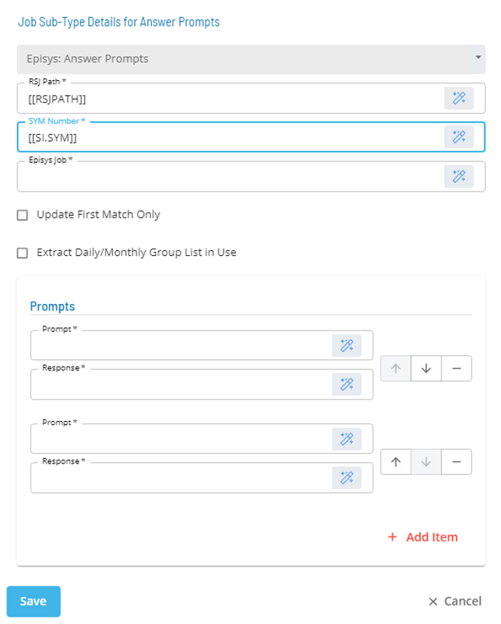

# Episys: Answer Prompts

* Calls an RSJ Utility called **update_scf**
* It updates a Batch Control File with answers to one or more prompts
* Prompts can be found by utilizing a utility called **find_prompts**

### Sub-Type



* **RSJ Path:** Defines the path to the directory on the UNIX Machine where the RSJ programs are installed.
* **SYM Number:** Defines the Episys "SYM" where the control file resides. The value should be a three-digit number or an OpCon token that resolves to a three-digit number.
* **Episys Job:** Defines the name of the job in Episys which contains the prompt(s) requiring answers. The name of the job is used to identify the Control File to update.
* **Update First Match Only:** Determines if the job will update only the first match for each prompt or if it will update all matches for each prompt.
* **Prompt/Response:** Defines the text for a Prompt and Response the Episys job will require.

:::tip Best Practice

It is best practice to store the path to RSJ in a **Global Property**, 

* **RSJPath** = ```/ops/bin```

and to store the SYM### as a **Schedule Instance**,

* **SYM** = ```000```

:::
