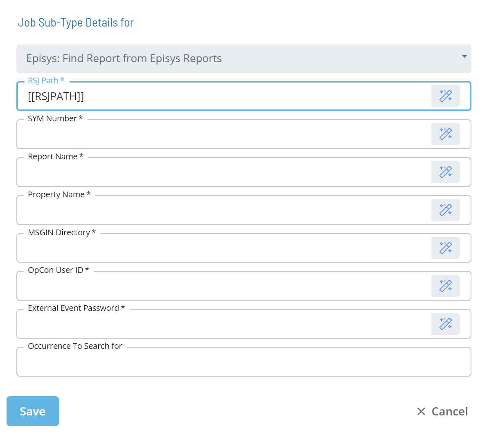

# Episys: Find Report From Episys Report

* Calls an RSJ Utility called **LookForReportSequenceInReports**
* Scans the Batch Output located in the ```/SYM/SYM###/REPORT``` directory
* Parses the SEQ# out of the Batch Output for a Batch Job that were **NOT** ran via RSJ
* Can specify an occurrence to search for
* Submits a **$PROPERTY:ADD** event so the **Property Value** will reflect the **SEQ#** found

### Sub-Type

<!--

-->

| Field | Required / Optional | Description |
| --- | --- | --- |
| RSJ Path | Required | Defines the path to the directory on the UNIX Machine where the RSJ programs are installed. |
| SYM Number | Required | Defines the Episys "SYM" where the control file resides. The value should be a three-digit number or an OpCon token that resolves to a three-digit number. |
| Episys Job | Required | Defines the name of the job that ran in Episys through RSJ. |
| Report Name | Required | Defines the name of the report whose sequence number is of interest. |
| Property Name | Required | Defines the name of the OpCon Property that will have its value set by this job.  |
| MSGIN Directory | Required | Defines the full path to the MSGIN directory on the UNIX machine the job will run on. |
| OpCon User ID | Required | Defines an OpCon User ID with privileges to "Maintain Global Properties". |
| External Event Password | Required | Defines the External Event Password for the OpCon User ID specified |
| Occurrence to Search for | Optional | Defines a numerical value (maximum value 99) that identifies the occurrence of the Report title to search for. |

:::tip Best Practice

It is recommened that the values for RSJ Path, SYM Number, MSGIN Directory, OpCon User ID, and External Event Password fields reference Global or Schedule Properties with the appropriate values. 

* **PATH_RSJ** = ```/ops/bin```
* **SI.SYM** = ```000```
* **PATH_UNIX_MSGIN** = ```/usr/local/lsam/msgin/3100```
* **USER_OCADM** = ```ocadm```
* **USER_TOKE** = ```ocadm's token```

:::

### LookForReportSequenceInReports Syntax

```[[RSJPATH]]/LookForReportSequenceInReports SYM### JOB.NAME PROPERTY.NAME UNIX_MSGIN USER "TOKEN” OCCURENCE```

| Parameter |	Required / Optional | Description |
| --- | --- | --- |
| ### | Required | This is the three digit SYM number of where the Batch Job was ran. |
| JOB.NAME | Required | This is the name of the subdiredctory to search. It will be the same name that is used when the RSJ job ran. |
| PROPERTY.NAME | Required | This is the name of the Property that will be updated with the SEQ number found for the Report. |
| UNIX_MSGIN | Required | This is the path to the UNIX MSGIN directory. |
| USER | Required | This is the user id that is submitted via the event that is submitted when the SEQ number is found. |
| TOKEN | Required | This is the token for the user id that is specified in the previous parameter. |
| OCCURENCE | Optional | This is the occurence of the report to search for. If nothing is specified, the first occurence is found. |

:::tip Examples

Here are some command line examples:

* ```/ops/bin/LookForReportSequenceInReports 000 ACH "SEQ.ACH REPORT" [[PATH_UNIX_MSGIN]] [[USER_OCADM]] "[[USER_TOKEN]]”```
* ```/ops/bin/LookForReportSequenceInReports 000 "Teller Totals by Branch" SEQ.GN.AFTER.OFFLINE [[PATH_UNIX_MSGIN]] [[USER_OCADM]] "[[USER_TOKEN]] 3```

:::