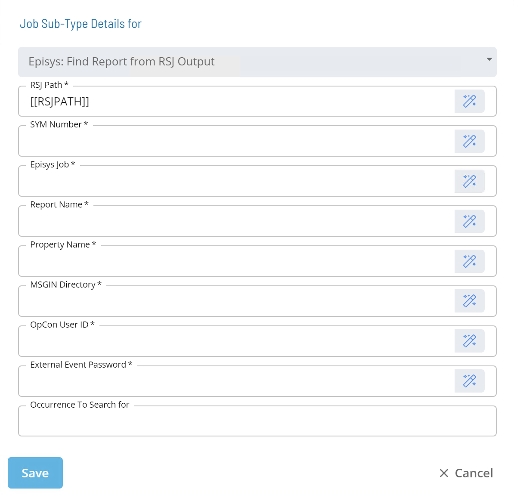

# Episys: Find Report from RSJ Output

* Calls an RSJ Utility called **LookForReportInRSJ**
* Scans the Batch Output located in the ```/SYM/SYM###/opcon_reports/<JOB.NAME>``` directory
* Parses the SEQ number out of the Batch Output for a Batch Job that was ran via RSJ
* Can specify an occurrence to search for
* Submits a **$PROPERTY:ADD** event so the **Property Value** will reflect the **SEQ#** found

### Sub-Type

<!--

-->

| Field | Required / Optional | Description |
| --- | --- | --- |
| RSJ Path | Required | Defines the path to the directory on the UNIX Machine where the RSJ programs are installed. |
| SYM Number | Required | Defines the Episys "SYM" where the control file resides. The value should be a three-digit number or an OpCon token that resolves to a three-digit number. |
| Episys Job | Required | Defines the name of the job that ran in Episys through RSJ. |
| Report Name | Required | Defines the name of the report whose sequence number is of interest. |
| Property Name | Required | Defines the name of the OpCon Property that will have its value set by this job.  |
| MSGIN Directory | Required | Defines the full path to the MSGIN directory on the UNIX machine the job will run on. |
| OpCon User ID | Required | Defines an OpCon User ID with privileges to "Maintain Global Properties". |
| External Event Password | Required | Defines the External Event Password for the OpCon User ID specified. |
| Occurrence to Search for | Optional | Defines a numerical value (maximum value 99) that identifies the occurrence of the Report title to search for. |

:::tip Best Practice

It is recommened that the values for RSJ Path, SYM Number, MSGIN Directory, OpCon User ID, and External Event Password fields reference Global or Schedule Properties with the appropriate values. 

* **PATH_RSJ** = ```/ops/bin```
* **SI.SYM** = ```000```
* **PATH_UNIX_MSGIN** = ```/usr/local/lsam/msgin/3100```
* **USER_OCADM** = ```ocadm```
* **USER_TOKE** = ```ocadm's token```

:::

### LookForReportInRSJ Syntax

```[[RSJPATH]]/LookForReportInRSJ SYM### JOB.NAME REPORT.NAME PROPERTY.NAME UNIX_MSGIN USER "TOKEN” OCCURENCE```

| Parameter |	Required / Optional | Description |
| --- | --- | --- |
| ### | Required | Defines the Episys "SYM" where the control file resides. The value should be a three-digit number or an OpCon token that resolves to a three-digit number. |
| JOB.NAME | Required | Defines the name of the job that ran in Episys through RSJ. |
| REPORT.NAME | Required | Defines the name of the report whose sequence number is of interest. |
| PROPERTY.NAME | Required | Defines the name of the OpCon Property that will have its value set by this job. |
| UNIX_MSGIN | Required | Defines the full path to the MSGIN directory on the UNIX machine the job will run on. |
| USER | Required | Defines an OpCon User ID with privileges to "Maintain Global Properties". |
| TOKEN | Required | Defines the External Event Password for the OpCon User ID specified. |
| OCCURENCE | Optional | Defines a numerical value (maximum value 99) that identifies the occurrence of the Report title to search for. |

:::tip Examples

Here are some command line examples:

* ```/ops/bin/LookForReportInRSJ 000 ACH.REPOST.JOB ACH "SEQ.ACH REPORT" [[PATH_UNIX_MSGIN]] [[USER_OCADM]] "[[USER_TOKEN]]”```
* ```/ops/bin/LookForReportInRSJ 000 GN.AFTER.OFFLINE "Teller Totals by Branch" SEQ.EXP_TELLER_TOTALS_AND_CHECKS [[PATH_UNIX_MSGIN]] [[USER_OCADM]] "[[USER_TOKEN]] 5```

:::

