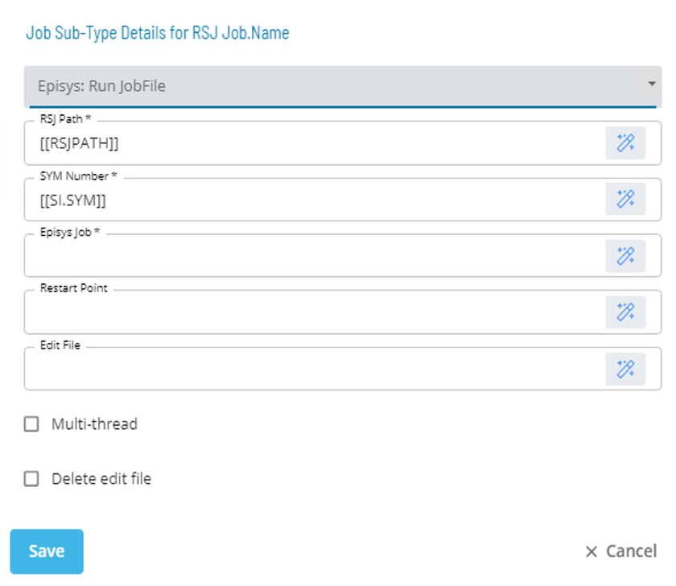
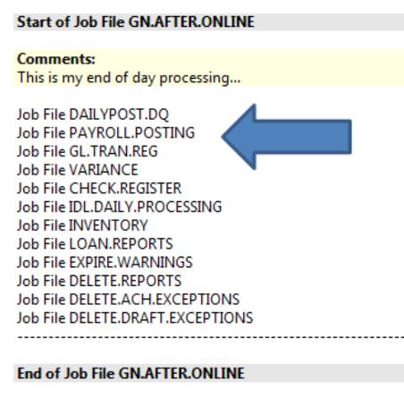
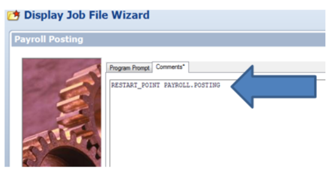

# Restart Point

* Allows a user to restart a Batch Job at a specific point
* Primarily used in event of a failure
* Can be utilized in a nested job
* Is specified as a Comment in the Batch Job in the following format ```RESTART_POINT <JOB.NAME>```

### Sub-Type Usage




| Field | Required / Optional | Description |
| --- | --- | --- |
| SYM Number | Required | The SYM# parameter is required. It tells RSJ which SYM to run the job in. The SYM number can be in either of the following formats: 000 or SYM00. |
| Episys Job | Required | The Job Name parameter is required. It tells RSJ the name of the Symitar Batch Job to Run |
| Restart Point | Optional | The restart_point parameter is optional. It tells RSJ the name of the restart point to look for tin a Symitar Batch File |
| Edit File | Optional | The name and path to the file that RSJ will move into EDITFILE. If an Edit File is specified the Multi-Thread check box isn’t available . |
| Multi-Thread Check Box | Optional | Allows RSJ to run multiple jobs at a time. Not available if an Edit File is specified. |
| Delete Edit File Check Box | Optional | Tells RSJ to delete the Edit File if specified after the Batch Job has run. |

### Restart_Point Syntax

 ```/ops/bin/RSJ [-Eeditfile_name] [-d] [-D] SYM# JobName [restart_point]```

| Command Line Parameter |	Required / Optional | Description |
| --- | --- | --- |
| -E<editfile_name> | Optional | The –E parameter is optional. It specifies the path and name of the file to move into the /SYM/SYMnnn/EDITFILE.DATA There is no space between the –E and the editfile_name. If an EDITFILE is specified, RSJ will automatically run the job in single_thread mode. |
| -D | Optional | It causes RSJ to delete the contents of /SYM/SYMnnn/opcon_reports/job_name_to_run before running the job. If the –D switch is not present on the command line; the directory will not be deleted before running the job. |
| -d | Optional |  It causes RSJ to delete the –E. Eeditfile_name upon successful completion of the job. If the –d switch is not present on the command line, the editfile_name file will not be deleted. |
| SYM# | Required | The SYM# parameter is required. It tells RSJ which SYM to run the job in. The SYM number can be in either of the following formats: 000 or SYM000. |
| JobName | Required | The JobName parameter is required. It tells RSJ the name of the Symitar Batch Job to run. |
| restart_point | Optional | The restart_point parameter is optional. It tells RSJ the name of a restart point to look for in a Symitar Batch Jobfile. For more information, refer to RESTART_POINT. |

:::tip Best Practice
* Locate the Job File that you want to restart from.

<!--

-->

* Add a comment to specify the restart point. ```RESTART_POINT [Jobfile Name]```
<!--

-->

* Modify the dailly version of the RSJ job to specify the Jobfile Name
<!--

-->
:::